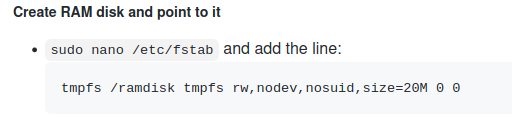

# HiveMind Push to Talk Satellite

Mycroft Push to Talk Satellite, connect to  [Mycroft HiveMind](https://github.com/JarbasSkills/skill-hivemind)


* [Setup](#setup)
* [Usage](#usage)
* [Configuration](#configuration)
  - [configure speech to text](#configure-speech-to-text)
  - [configure text to speech](#configure-text-to-speech)
  - [configure listener](#configure-listener)
  - [configure audio playback](#configure-audio-playback)

Watch it running in a [pinephone](https://www.pine64.org/pinephone/)
[](https://www.youtube.com/watch?v=Mn59YN-AW2A&feature=youtu.be)

## Install

```bash
$ pip install HiveMind-PtT
```
## Usage

If host is not provided auto discovery will be used

```bash
$ HiveMind-ptt --help

usage: HiveMind-ptt [-h] [--access_key ACCESS_KEY] [--crypto_key CRYPTO_KEY] [--name NAME] [--host HOST] [--port PORT]

optional arguments:
  -h, --help            show this help message and exit
  --access_key ACCESS_KEY
                        access key
  --crypto_key CRYPTO_KEY
                        payload encryption key
  --name NAME           human readable device name
  --host HOST           HiveMind host
  --port PORT           HiveMind port number
```

Default values are

```
--access_key - "RESISTENCEisFUTILE"
--crypto_key - "resistanceISfutile"
--name - "JarbasPushToTalkTerminal"
--port" - 5678

```

## Signals

To interact with this you need to create signals, signals are just temporary files, no UI has been made at this time

ipc_path can be set in config, default is ```/tmp/hivemind/ipc``` creating a [tmpfs](https://en.wikipedia.org/wiki/Tmpfs) is strongly recommended



### Listening

To trigger listening you need to create a signal named startListening

```bash
 touch {ipc_path}/signal/startListening
```

### Button Press

Some support for a button press is there, this will also trigger listening, 
but gives a chance (0.25 seconds currently) for other processes to intercept 
this signal

```bash
 touch {ipc_path}/signal/buttonPress
```

### Adjust ambient noise

If VAD is not working that well for you, you can trigger an adjustment for ambient noise, be sure to be silent during this process

```bash
 touch {ipc_path}/signal/adjustAmbientNoise
```

## Configuration

You can set the configuration at
    
    ~/.cache/json_database/HivemindPtT.json
    
Otherwise default configuration will be used, check bellow for defaults

### configure speech to text
```json
{
    "lang": "en-us",
    "stt": {
        "module": "google"
    }
}
```

### configure text to speech
```json
{
    "lang": "en-us",
    "tts": {
        "module": "responsive_voice"
    }
}
```

### configure listener

```json
{
    "data_dir": "~/jarbasHiveMind/recordings",
    "listener": {
        "sample_rate": 16000,
        "channels": 1,
        "record_utterances": false,
        "multiplier": 1.0,
        "energy_ratio": 1.5,
        "signal_folder": "/tmp/hivemind/ipc",
        "listen_sound": "snd/start_listening.wav",
        "error_sound": "snd/listening_error.mp3"
    }
}
```
data_dir is where recordings are saved, 

    {data_dir}/utterances

if you are having trouble finding the microphone you can optionally set device_index

```json
{
    "listener": {
        "device_index": 0
    }
}
```  
or device_name, which is a name or regex pattern
```json
{
    "listener": {
        "device_name": "respeaker"
    }
}
```  


### Configure audio playback

you shouldn"t need to change this, a common change is replacing ```aplay``` with ```paplay``` when using pulseaudio, or use sox for everything

```json
{
    "playback": {
        "play_wav_cmd": "aplay %1",
        "play_mp3_cmd": "mpg123 %1",
        "play_ogg_cmd": "ogg123 -q %1",
        "play_fallback_cmd": "play %1"
    }
}

```